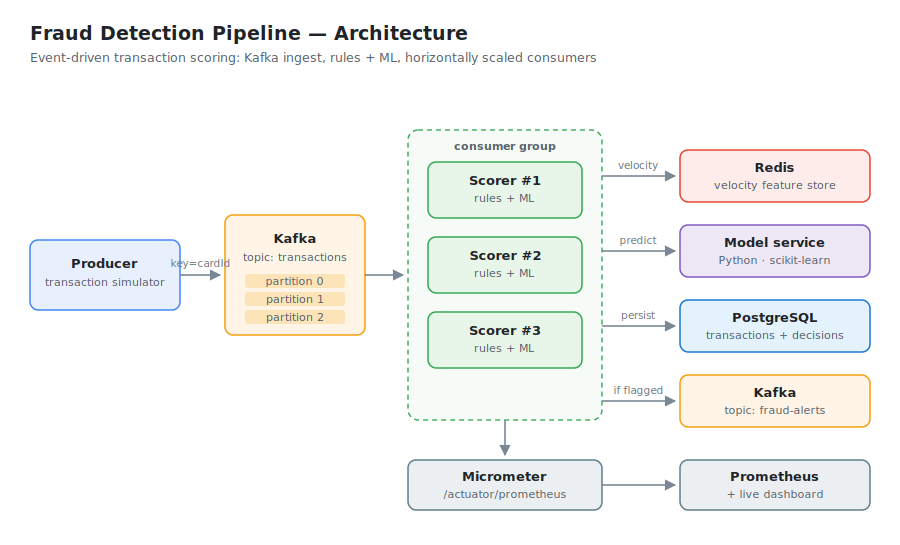
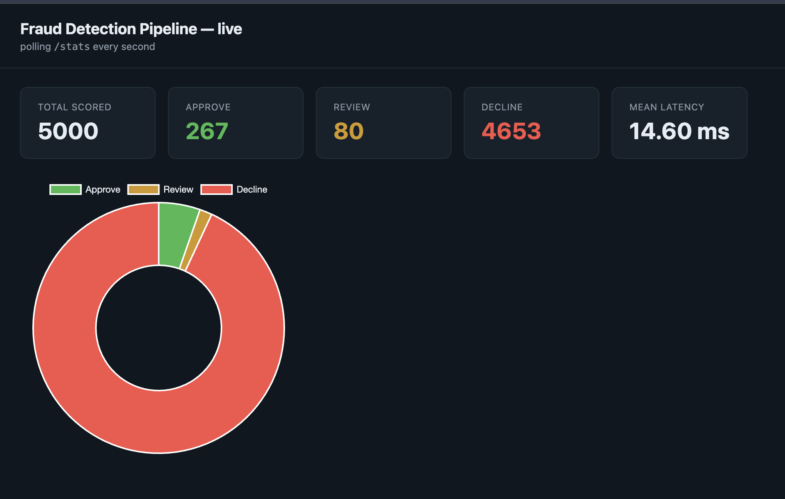
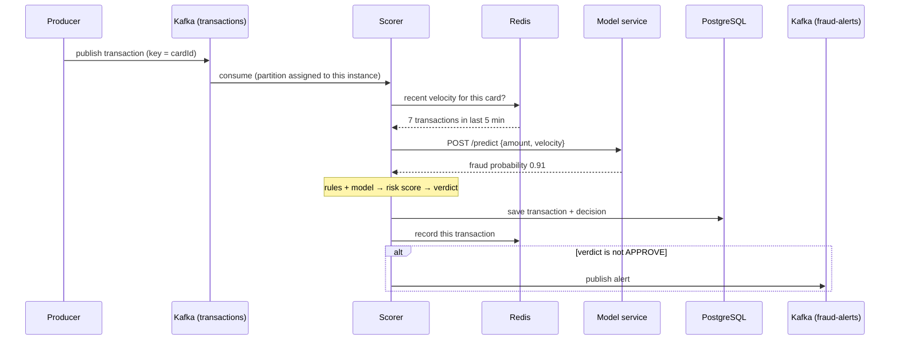

<h1 align="center">Fraud Detection Pipeline</h1>

<p align="center">
  <b>A real-time, event-driven system that scores payment transactions for fraud — built to scale horizontally.</b><br>
  Java · Spring Boot · Apache Kafka · Redis · PostgreSQL · Python (scikit-learn) · Docker
</p>

<p align="center">
  <a href="https://github.com/cdandeniya/fraud-detection/actions/workflows/ci.yml"></a>
  
  
  
  
  
  
  
</p>

---

## What it is

Payment transactions stream in through Kafka. A pool of scoring services — running as a Kafka
consumer group so they share the load — puts each transaction through a rules engine **and** a
machine-learning model, using the card's recent behavior cached in Redis. Each one comes back
with a decision (**APPROVE**, **REVIEW**, or **DECLINE**) and the reasons behind it. Everything
is persisted to PostgreSQL, flagged transactions are published to an alerts topic, and the whole
pipeline is instrumented with Prometheus metrics and a live dashboard.

I built this to learn distributed systems by actually building one, rather than just reading
about them. Every design decision in here is one I can explain — the reasoning is written up in
**[DESIGN.md](DESIGN.md)**.

## Architecture

<p align="center">
  
</p>

<!-- Once you've run it, drop a screenshot of the dashboard at docs/dashboard.png and uncomment:
## Live dashboard
<p align="center"></p>
-->

## What this project demonstrates

| Engineering concept | Where it shows up here |
|---|---|
| **Asynchronous processing / queues** | Kafka sits between ingest and scoring, so traffic spikes become a longer queue instead of dropped requests |
| **Horizontal scaling & load balancing** | Scorers run in a Kafka consumer group; partitions are split across instances and rebalance automatically when one dies |
| **Caching strategy** | Redis sorted sets give O(log n) sliding-window velocity counts instead of a `COUNT(*)` on the hot path |
| **Data partitioning** | Messages keyed by card id, so a card's transactions stay ordered and land on one consumer |
| **Resilience / graceful degradation** | The ML client *fails open* — if the model service is down, scoring continues on rules alone |
| **Consistency vs. availability** | Durable decisions favor consistency (Postgres); best-effort signals favor availability (Redis, model) |
| **Extensible design** | Rules are `@Component`s implementing one interface — adding a check requires no changes to the engine |
| **Observability** | Micrometer counters + latency percentiles, scraped by Prometheus, shown on a live dashboard |
| **Testing** | 14 tests that mock Kafka, Redis, and the model — the suite runs with zero infrastructure |

## How one transaction flows



## The checks

Each check contributes points to a risk score. The total maps to a verdict:
`0` → APPROVE, `1–69` → REVIEW, `70+` → DECLINE.

| Check | Fires when | Points |
|---|---|---|
| **High amount** | Amount exceeds a configurable threshold (default $1,000) | 45 |
| **New country** | Card used in a country it's never been seen in (new cards exempt) | 40 |
| **Velocity** | More than N transactions in 5 minutes — the card-testing pattern | 35 |
| **ML model** | Logistic regression's fraud probability crosses a threshold | up to 50 |

## Quick start

Requires JDK 17 and Docker.

```bash
# run everything, scaled to three scoring instances
docker compose up --build --scale scorer=3
```

Or run the infrastructure in Docker and the app from your IDE:

```bash
docker compose up -d db redis kafka model prometheus
mvn spring-boot:run
```

Then open **http://localhost:8080/** for the live dashboard.

Score a transaction by hand:

```bash
curl -X POST http://localhost:8080/score \
  -H "Content-Type: application/json" \
  -d '{"cardId":"card-1","amount":5000,"merchant":"Amazon","country":"RU"}'
```

```json
{
  "transactionId": 42,
  "verdict": "DECLINE",
  "score": 85,
  "reasons": [
    "amount 5000 is over the 1000 threshold",
    "first time card card-1 has been used in RU"
  ]
}
```

Watch the alerts stream:

```bash
docker exec -it fraud-kafka /opt/kafka/bin/kafka-console-consumer.sh \
  --bootstrap-server localhost:9092 --topic fraud-alerts --from-beginning
```

## Benchmarking it

A dependency-free load test ships with the repo — it reports throughput and latency percentiles:

```bash
python3 loadtest/loadtest.py --requests 5000 --concurrency 50
```

## Tests

```bash
mvn test
```

14 tests covering the rules engine, the velocity and model rules, the Kafka consumer's routing,
and the metrics. Kafka, Redis, and the model service are all mocked and the database is
in-memory H2, so the suite needs nothing running.

## Tech stack

| Layer | Technology | Why |
|---|---|---|
| Service | Java 17, Spring Boot 3.2 | Strong typing and a mature ecosystem for streaming consumers |
| Streaming | Apache Kafka | Decouples ingest from scoring; consumer groups give scale-out for free |
| Cache / features | Redis | Sorted sets make sliding-window counts cheap; TTLs expire old data automatically |
| Database | PostgreSQL | Durable record of every transaction and decision |
| ML | Python, scikit-learn, FastAPI | Trains and serves the model behind a clean HTTP boundary |
| Metrics | Micrometer + Prometheus | Throughput and latency percentiles, scraped and visualized |
| Infrastructure | Docker Compose | One command brings up and scales the entire system |
| Testing | JUnit 5, Mockito, H2 | Fast, infrastructure-free test suite |

## Design decisions

The full write-up is in **[DESIGN.md](DESIGN.md)** — failure modes for every component,
delivery semantics, and the gaps I'd close next. A few highlights:

- **Why a queue in the middle?** Scoring inside the HTTP request means spikes back up onto the
  caller and you can only scale vertically. A queue turns a spike into a longer queue.
- **Why partition by card?** Kafka only guarantees ordering within a partition, so keying by
  card keeps each card's history ordered and pinned to one consumer.
- **Why does the model fail open?** A fraud *check* shouldn't be able to take down the fraud
  *system*. Degraded scoring beats no scoring.
- **What's still missing?** Idempotent consumption on `eventId`, a dead-letter queue, and the
  outbox pattern — all documented rather than glossed over.

## Understanding the system

[**STUDY_GUIDE.md**](STUDY_GUIDE.md) walks the full path of a single transaction through the
code, then explains each concept behind it — Kafka partitions and consumer groups, the Redis
sliding-window feature store, dependency injection, the ML metrics that matter on imbalanced
data, and the trade-offs I chose.

## Project structure

```
src/main/java/com/cdandeniya/fraud/
├── controller/    REST endpoints (/score, /stats)
├── service/       scoring orchestration
├── engine/        rules engine + verdict logic
├── rules/         individual checks (amount, country, velocity, model)
├── features/      Redis-backed feature store
├── messaging/     Kafka producer, consumer, simulator, messages
├── ml/            client for the Python model service
├── metrics/       Micrometer instrumentation
├── model/         JPA entities
└── repository/    Spring Data repositories

model/             Python model service (train.py, app.py, Dockerfile)
loadtest/          standard-library load test
ops/               Prometheus config
docs/              architecture diagram
```

## How it was built

Seven stages, each adding exactly one concept so I understood it before moving on:

| Stage | Focus | Concept |
|---|---|---|
| 1 | REST endpoint, rules engine, Postgres | Single-server baseline |
| 2 | Redis feature store | Caching computed features |
| 3 | Kafka producer + consumer | Asynchronous processing |
| 4 | Consumer group, partitioning | Horizontal scaling |
| 5 | Python model service | Service boundaries, fail-open |
| 6 | Metrics, dashboard, load test | Latency vs. throughput |
| 7 | CI, design write-up | Consistency vs. availability |

## Notes

All transaction data is synthetic — generated by the simulator or drawn from public datasets.
No real cardholder data is involved. This is a personal learning project, not production software.

---

<p align="center">
  <b>Chanul Dandeniya</b> · Computer Science, Stony Brook University<br>
  <a href="mailto:chanul.dandeniya@stonybrook.edu">chanul.dandeniya@stonybrook.edu</a>
</p>
